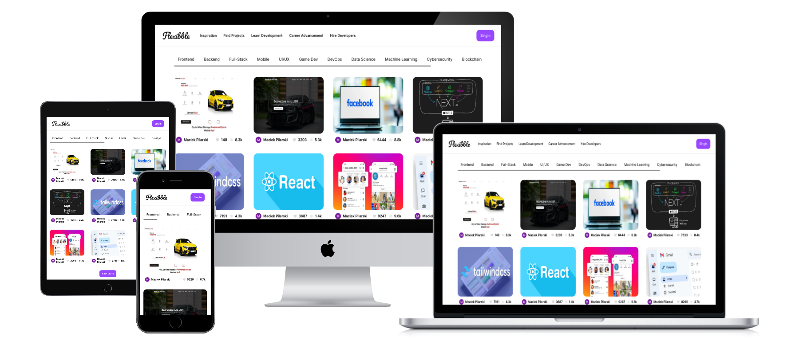

# Flexibble - Fullstack App

**Live Preview: [Here](https://flexibble-steel-psi.vercel.app)**

Fully responsive and modern looking Dribble Clone. Remember, it's not full functionaly project!

---

**NextJS 13, Tailwind and Grafbase** made as a practice project. There is fullstack app, with CRUD. App as Dribble. In this project I learned how to create modern UI, understand how is Tailwind working and Tailwind best practices. Now I know how to use **GraphQL**, add, edit and delete elements also with filtering by links. By this project I betterment also my JS and Next skills.   The page contains multiple views:
- Home page,
- Login/SignIn by google (OAuth 2.0),
- Modal view (Details, Add and Edit)
- Profil page,

### What you can do?
- Login/SignIn,
- Add, edit and delete project (You have to reload page after operation),
- Look at other people projects,
- Check users profiles with their projects,
- Use filters for categories
This app is working little bit slow. But...
It will be think to do later!

### This app can be expanded:
- Improve performance,
- Add other pages and links,
- Add auto reload after adding/deleting/editing element

## In project are used: 
- Reuseable components,
- Mapping,
- Responsive Web Design (RWD),
- Database,
- Pagination,
- SSR,
- NextAuth
- JsonWebToken

## Tools Used
1. JavaScript (NextJS 13 + TypeScript)
2. Vite
3. Tailwind (Styles)
4. Vercel (Deployment)
5. VSCode (Code Editor)
6. Grafbase (Database)
7. HeadlessUI (Components)
8. Cloudinary
 
 
 
Deploy on Vercel free,

[Link to tutorial with JSMastery](https://www.youtube.com/watch?v=986hztrfaSQ)
